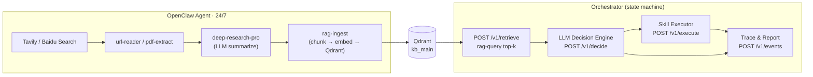

# WebClaw · RAG-Enhanced LLM Pentest Platform

> **An LLM-guided pentest orchestrator backed by a 24/7 self-updating Qdrant knowledge base — PTES 7-phase, JSON-Schema-validated module contracts, Python crawler + Node.js skills.**
>
> 大模型驱动、RAG 知识库持续增强的自动化渗透测试平台。OpenClaw Agent 全天候爬取安全情报写入 Qdrant，LLM 决策引擎根据语义检索结果规划下一步工具调用，覆盖 PTES 七阶段完整渗透测试流程。服务外包大赛 A10 参赛项目。

[English](#english) · [中文](#中文)


---

<a id="english"></a>

## TL;DR

WebClaw is the **knowledge and RAG layer** of an AI-driven pentest platform. The core insight: raw LLM reasoning for security tasks degrades quickly without up-to-date vulnerability intelligence. WebClaw solves this with **OpenClaw** — a persistent agent that runs a 24/7 loop (search → fetch → LLM refine → chunk → embed → Qdrant ingest) across 50+ security topics. At decision time, the Orchestrator calls `POST /v1/retrieve` to semantically enrich its LLM prompt with fresh CVE/PoC context before choosing the next skill to execute.

## Architecture · 架构



### PTES phase flow

```
Pre-engagement → Intelligence Gathering → Threat Modeling
    → Vulnerability Analysis → Exploitation → Post-Exploitation → Reporting
```

Phase transitions only after **all sub-tasks reach terminal state** (done / failed / timeout).

## Module contracts (REST / JSON Schema)

| Caller → Callee | Endpoint | Key I/O |
|---|---|---|
| Orchestrator → RAG | `POST /v1/retrieve` | in: `phase, query, target_context_snapshot` · out: `chunks[]` (source, type, cve_id) |
| Orchestrator → LLM | `POST /v1/decide` | in: `current_phase, history_summary` · out: `action_type, skill_id, params` |
| Orchestrator → Skill | `POST /v1/execute` | in: `skill_id, target, params` · out: `status, parsed_artifacts, raw_stdout` |
| Any → Trace | `POST /v1/events` | `task_id, event_type, source_module, payload` (fire-and-forget) |
| Any → Report | `POST /v1/reports/generate` | in: `task_id, options` · out: `report_id, download_url` |

Full JSON Schema: `自动化渗透测试平台-架构设计文档.md` §12.

## Quickstart

```bash
# 1. Python deps
pip install -r rag_crawler/requirements.txt

# 2. Node.js deps (each skill is independent)
cd skills/rag-query && npm install
cd skills/rag-ingest && npm install

# 3. Qdrant
docker run -d -p 6333:6333 qdrant/qdrant

# 4. env
cp rag_crawler/env.example rag_crawler/.env
$EDITOR rag_crawler/.env    # fill OPENAI_API_KEY + TAVILY_API_KEY

# 5. start the knowledge crawler
cd rag_crawler && python crawler.py

# skip LLM calls — raw ingest only (fast bootstrap)
OPENCLAW_SKIP_LLM=1 python crawler.py

# single topic
python crawler.py --topic "Struts2 S2-045"

# 6. query the knowledge base
node skills/rag-query/scripts/query.mjs "Struts2 S2-045 漏洞检测"
node skills/rag-query/scripts/query.mjs --query "CVE-2017-5638" --top-k 5 --topic-tags "cve,poc"
```

### Minimum env

```env
OPENAI_API_KEY=sk-...
TAVILY_API_KEY=tvly-...
QDRANT_URL=http://127.0.0.1:6333
```

Detailed variable reference: `rag_crawler/CONFIG.md`.

## Technical highlights · 技术亮点 (STAR)

<details>
<summary><b>📚 Self-updating security knowledge base</b> — OpenClaw 24/7 ingest loop</summary>

- **S**: Static vulnerability datasets go stale within weeks; LLM pre-training data has a knowledge cutoff. A pentest platform that relies on memorized CVE knowledge will miss newly disclosed vulnerabilities.
- **A**: OpenClaw Agent runs a continuous loop: Tavily/Baidu search for seeded topics → url-reader / pdf-extract → LLM `deep-research-pro` skill distills raw HTML/PDF into structured security summaries → `rag-ingest` chunks, embeds, and writes to Qdrant `kb_main`. The `OPENCLAW_SKIP_LLM=1` flag allows raw-ingest bootstrapping without LLM cost.
- **R**: The knowledge base grows without human intervention. The Orchestrator always retrieves the freshest context at decision time.
</details>

<details>
<summary><b>🔗 Stateless modules with JSON-Schema-validated contracts</b></summary>

- **A**: Only the Orchestrator holds state. All other modules (RAG, LLM, Executor, Trace) are stateless REST services. Every cross-module API has a published JSON Schema; CI mocks validate against the schema so interface drift is caught before integration.
- Why it matters: you can replace the LLM backend (GPT → Claude → DeepSeek) by swapping one service without touching the Orchestrator.
</details>

<details>
<summary><b>🛡️ Repetition prevention without extra state</b></summary>

Classic agentic loops repeat tool calls when the LLM forgets recent history. WebClaw injects **"duplicate warning" markers** directly into the LLM input message when the same `skill_id + params` fingerprint already appears in the phase history — no separate dedup state, no extra API call. The Orchestrator's phase task table remains the single source of truth.
</details>

<details>
<summary><b>⚡ Sync/async dispatch by task duration</b></summary>

Short skills (≤ 2 min, e.g. Nmap SYN scan, Nuclei quick scan) are dispatched synchronously with a hard timeout. Long skills (e.g. full Metasploit brute-force, multi-target Nuclei template run) go into the async RabbitMQ queue. The Orchestrator only blocks on sync calls; async completions are delivered as events to `POST /v1/events`. This design lets concurrent targets share the Executor pool without starving each other.
</details>

## Quantitative targets · 量化技术指标

| Metric | Baseline | Advanced |
|---|---|---|
| Vulnerability detection rate | ≥ 90% | ≥ 95% |
| False-positive rate | ≤ 10% | ≤ 5% |
| Tools integrated | ≥ 30 | ≥ 50 |
| Time per target | ≤ 30 min | ≤ 15 min |
| Concurrent targets | ≥ 1 | ≥ 3 |
| Multi-stage chain | single | multi-stage |
| Report quality | basic | full + remediation |
| OS targets | Linux or Windows | Linux + Windows |

## Validated targets · 靶机验证

**Vulhub (Easy)** — Struts2 S2-045/S2-057, ThinkPHP 5.0.23-RCE, WebLogic CVE-2023-21839, Tomcat CVE-2017-12615, PHP CVE-2019-11043, ActiveMQ CVE-2022-41678, JBoss CVE-2017-7504, Shiro CVE-2016-4437, Fastjson 1.2.24/1.2.47 RCE, Django CVE-2022-34265, Flask SSTI, GeoServer CVE-2024-36401

**Vulnhub (Medium/Hard)** — Tomato, Earth, Jangow, Phineas, Odin

## Roadmap · 路线图

- [x] Qdrant RAG knowledge base (kb_main collection)
- [x] OpenClaw 24/7 ingest pipeline with LLM refinement
- [x] rag-query / rag-ingest Node.js ESM skills
- [x] JSON-Schema-validated module contracts
- [x] Sync/async skill dispatch design
- [ ] Live integration with PentestPlatform Orchestrator (replace mock `POST /v1/retrieve`)
- [ ] Scheduled topic refresh with staleness scoring
- [ ] CVE severity tagging on ingest (CVSS score from NVD API)
- [ ] Kubernetes deployment for multi-instance crawler scale-out

## Repo layout

```
WebClaw/
├── skills/                  rag-query + rag-ingest (Node.js ESM)
├── openclawSkills/          pre-built OpenClaw skill pack
│   ├── deep-research-pro/   LLM-powered structured summarization
│   ├── pdf-extract/         PDF text extraction
│   ├── markdown-converter/  HTML/doc → Markdown
│   └── …
├── rag_crawler/             Python knowledge acquisition pipeline
│   ├── crawler.py           main loop: search → fetch → refine → ingest
│   ├── skills_impl/         local skill implementations
│   ├── topics.txt           seed topics
│   ├── CONFIG.md            env var reference
│   └── requirements.txt
├── kb-openclaw/             KB architecture docs + OpenClaw mission configs
├── systemPrompt/            OpenClaw agent system prompts (SOUL, TOOL, AGENTS…)
├── docs/                    design documents
├── search_topics.json       structured topic definitions
├── clean_content.py         KB content cleaning utility
└── 自动化渗透测试平台-架构设计文档.md   full system design (§12 = JSON Schemas)
```

---

<a id="中文"></a>

## 中文速读

- **是什么**：WebClaw 是 AI 渗透测试平台的**知识增强层**。OpenClaw Agent 24/7 运行「搜索→抓取→LLM 精炼→向量入库」循环，持续为 Orchestrator 的决策引擎提供最新 CVE/PoC 情报。
- **核心价值**：大模型预训练知识有截止日期；WebClaw 用自维护的 Qdrant 知识库解决「知识过时」问题，每次 LLM 决策前注入当前最新的安全语义上下文。
- **技术特色**：
  - **无状态模块化**：只有 Orchestrator 有状态，其余模块（RAG/LLM/Executor/Trace）均无状态 REST 服务，接口有 JSON Schema 约束；
  - **重复防控轻量化**：用「重复警告注入」替代独立去重状态机，Orchestrator 任务表即唯一事实来源；
  - **同步/异步调度**：短任务（≤2 min）同步含超时，长扫描走 RabbitMQ 异步队列，多目标共享 Executor 不互相阻塞。

## License

MIT © [Seal-Re](https://github.com/Seal-Re)
